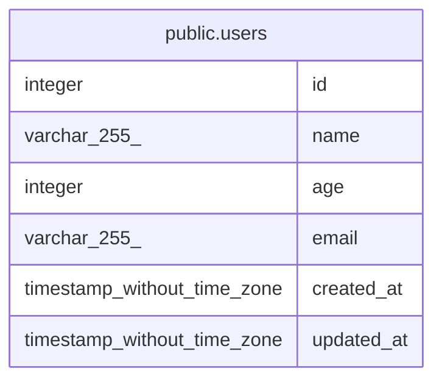

# sample_tbls

## Tables

| Name | Columns | Comment | Type |
| ---- | ------- | ------- | ---- |
| [public.users](public.users.md) | 6 | ユーザー情報を格納するテーブル | BASE TABLE |

## Relations

---

> Generated by [tbls](https://github.com/k1LoW/tbls)
